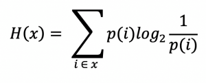
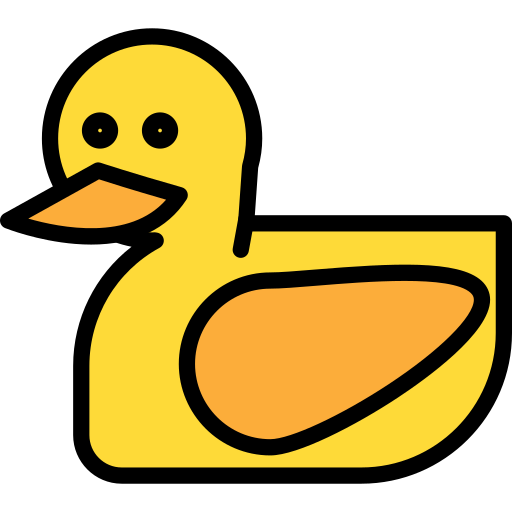

  

##

 
     
     
   
  
   
  
I'm a Computer Engineer student with a Master's degree at <strong>CentraleSupélec 🇫🇷</strong> and a Bachelor's one at <strong>UFC 🇧🇷</strong>. I'm always excited 
(with a little coffee boost sometimes :sweat_smile:)
 to dig into new things and unreveal the mysteries behind software engineering! :sunglasses:

 
 <table border="0">
 <tr>
    <td><b style="font-size:30px">What I want to be</b></td>
    <td><b style="font-size:30px">What prevents me to be what I want</b></td>
 </tr>
 <tr>
    <td>A powerful pragmatic programmer</td>
    <td></td>
 </tr>
</table>

Being most of the time a language-agnostic myself, I love learning new technologies and ways to improve my work. A <strong>sparkle of curiosity</strong> is all it takes
to keep myself motivated. Through my college years I studied different topics, from hardcore hardware to delightful  software. As my early goal 
  to become a <strong>Backend Software engineer</strong>, I focus currenty my study time in <strong>Java, Python and C#. </strong>

##

<h2> Tehcnical Stack </h2>

<strong>Fun facts about me:</strong>
 

&nbsp;&nbsp;&nbsp;&nbsp;  &nbsp;&nbsp;I'm a real fast-learner

&nbsp;&nbsp;&nbsp;&nbsp;  &nbsp;&nbsp; I like the multi- suffix, I am <strong>multiskilled</strong> and work in a <strong>multicultural team</strong>

&nbsp;&nbsp;&nbsp;&nbsp;  &nbsp;&nbsp; The rubber duck debug technique is my favorite

 
  
  
  
  
  
  

